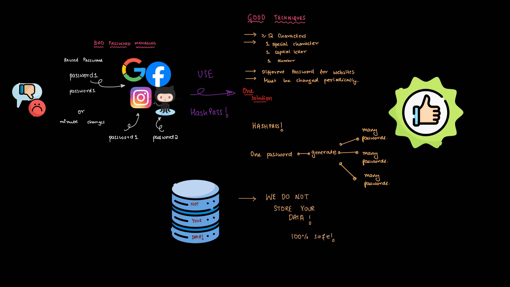

# Project Title

HashPass - Secure Password Generator

## Description

HashPass is a web-based tool for generating secure passwords based on a unique input and website name. It provides a simple and secure way to create passwords that meet modern security standards.

## Table of Contents

- [Installation](#installation)
- [Usage](#usage)
- [Features](#features)
- [Contributing](#contributing)
- [License](#license)
- [Screenshots](#screenshots)

## Installation

1. Clone the repository: `git clone https://github.com/yourusername/hashpass.git`
2. Navigate into the project directory: `cd hashpass`
3. Install dependencies: `npm install`
4. Start the application: `npm start`

## Usage

1. Fill in the 'Password' and 'Website Name' fields.
2. Click on the 'Generate' button to create a unique password.
3. Click on the 'Copy' button to copy the generated password to the clipboard.

## Features

- Password generation based on website name and a unique password input.
- Validation to ensure generated passwords meet security requirements.
- Copy password functionality for easy use.

## Contributing

Contributions are welcome! Please follow these steps:

- Report issues: Submit issues or bug reports.
- Enhancements: Suggest enhancements or new features.
- Pull requests: Submit pull requests with improvements.

## License

This project is licensed under the MIT License - see the [LICENSE](LICENSE) file for details.

## Screenshots

This screenshot demonstrates the password generation feature in HashPass.
